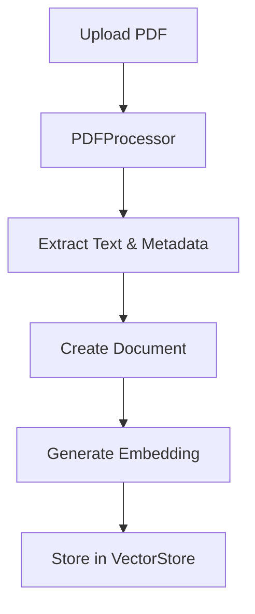
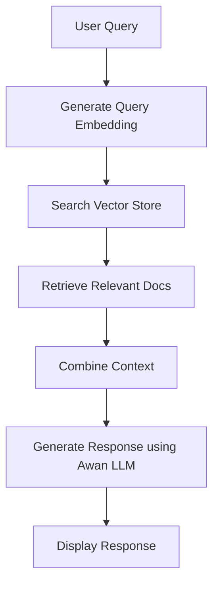

# Sheldor - Architecture Documentation

## Overview

Sheldor is a Retrieval Augmented Generation (RAG) system built with a layered architecture pattern. It combines local LLM capabilities through Awan LLM with a personality-driven interface inspired by Dr. Sheldon Cooper.

## System Architecture

### 1. Core Components

```
sheldor/
├── models.py          # Core abstractions and implementations
├── main.py           # Main RAG system orchestration
├── document_processor.py  # Document handling
├── ui.py             # User interface
├── exceptions.py     # Custom error handling
├── logging_config.py # Logging setup
└── config.py         # System configuration
```

### 2. Layer Descriptions

#### 2.1 Data Layer
- **Document Class** (`models.py`): 
  - Represents a document with content, metadata, and embeddings
  - Used throughout the system for document handling
  ```python
  @dataclass
  class Document:
      content: str
      metadata: Dict[str, Any]
      embedding: Optional[List[float]] = None
  ```

#### 2.2 Model Layer
- **Abstract Base Classes** (`models.py`):
  - `EmbeddingModel`: Interface for embedding generation
  - `LLMModel`: Interface for text generation
  - `VectorStore`: Interface for document storage and retrieval

- **Concrete Implementations**:
  - `OllamaEmbedding`: Generates embeddings using Ollama
  - `AwanLLM`: Handles text generation with Sheldon's personality using Awan LLM
  - `InMemoryVectorStore`: Manages document storage and similarity search

#### 2.3 Service Layer
- **RAG System** (`main.py`):
  - Orchestrates interactions between components
  - Manages document addition and querying
  - Handles context retrieval and response generation

- **Document Processor** (`document_processor.py`):
  - Handles PDF document processing
  - Extracts text and metadata
  - Prepares documents for ingestion

#### 2.4 Presentation Layer
- **Streamlit UI** (`ui.py`):
  - Provides web interface
  - Handles file uploads
  - Manages chat interactions
  - Maintains session state

### 3. Data Flow

1. **Document Ingestion Flow**:


2. **Query Processing Flow**:


### 4. Key Components in Detail

#### 4.1 Vector Store Implementation
```python
class InMemoryVectorStore:
    def __init__(self):
        self.documents: List[Document] = []

    async def search(self, query_embedding: List[float], k: int = 3) -> List[Document]:
        # Uses cosine similarity for document retrieval
        similarities = []
        for doc in self.documents:
            similarity = self._cosine_similarity(query_embedding, doc.embedding)
            similarities.append((similarity, doc))
        return [doc for _, doc in sorted(similarities, reverse=True)[:k]]
```

#### 4.2 LLM Integration
```python
class AwanLLM:
    async def generate(self, prompt: str, context: Optional[str] = None) -> str:
        # Combines system prompt, context, and user query
        full_prompt = self._construct_prompt(prompt, context)
        response = await self._make_request_to_awan_llm(full_prompt)
        return response
```

### 5. Async Operation Handling

The system uses asyncio for asynchronous operations:
1. Document processing
2. Embedding generation
3. LLM queries
4. Vector store operations

Example async flow:
```python
async def process_query(self, query: str) -> str:
    # 1. Generate query embedding
    query_embedding = await self.embedding_model.embed(query)
    
    # 2. Search for relevant documents
    relevant_docs = await self.vector_store.search(query_embedding)
    
    # 3. Generate response
    context = self._combine_documents(relevant_docs)
    response = await self.llm_model.generate(query, context)
    
    return response
```

### 6. Error Handling

The system implements a hierarchical error handling system:
```
SheldorError (base)
├── ModelError
├── VectorStoreError
└── DocumentError
```

Each error type provides Sheldon-style error messages for better user experience.

### 7. Configuration Management

System configuration is managed through:
1. Environment variables
2. Pydantic settings class
3. Runtime configuration

Example configuration:
```python
class Settings(BaseSettings):
    DEFAULT_LLM_MODEL: str = "Meta-Llama-3-8B-Instruct"
    DEFAULT_EMBEDDING_MODEL: str = "deepseek-r1"
    LOG_LEVEL: str = "INFO"
    AWANLLM_API_KEY: str  # API key for Awan LLM service
```

### 8. Testing Strategy

Tests are organized by component:
1. Unit tests for individual components
2. Integration tests for component interactions
3. Personality tests for response characteristics

Example test:
```python
@pytest.mark.asyncio
async def test_personality_traits(rag_system):
    response = await rag_system.query("What is quantum mechanics?")
    assert any([ 
        "theoretical physicist" in response,
        "physics" in response.lower(),
        "scientific" in response.lower()
    ])
```

## Development Guidelines

### 1. Adding New Features

1. Create appropriate abstractions in `models.py`
2. Implement concrete classes
3. Update the RAG system in `main.py`
4. Add UI components if needed
5. Write tests
6. Update documentation

### 2. Modifying Personality

1. Update `SHELDON_SYSTEM_PROMPT` in `models.py`
2. Add new personality tests
3. Update error messages in `exceptions.py`

### 3. Adding New Document Types

1. Create new processor in `document_processor.py`
2. Implement extraction logic
3. Update UI for new file type
4. Add appropriate tests

### 4. Performance Optimization

1. Monitor embedding generation
2. Optimize vector similarity search
3. Implement caching if needed
4. Profile async operations

## Deployment

1. Environment Setup:
```bash
python -m venv .venv
source .venv/bin/activate
pip install -r requirements.txt
```

2. Configuration:
```bash
export SHELDOR_DEFAULT_LLM_MODEL=Meta-Llama-3-8B-Instruct
export SHELDOR_LOG_LEVEL=INFO
export AWANLLM_API_KEY='your_api_key_here'
```

3. Run Application:
```bash
streamlit run sheldor/ui.py
```

## Monitoring and Logging

The system uses a hierarchical logging system:
1. Application-level logs
2. Component-specific logs
3. Error tracking
4. Performance metrics

## Future Considerations

1. Database integration for persistent storage
2. API endpoints for headless operation
3. Support for additional document types
4. Enhanced similarity search algorithms
5. Caching layer for improved performance

---
